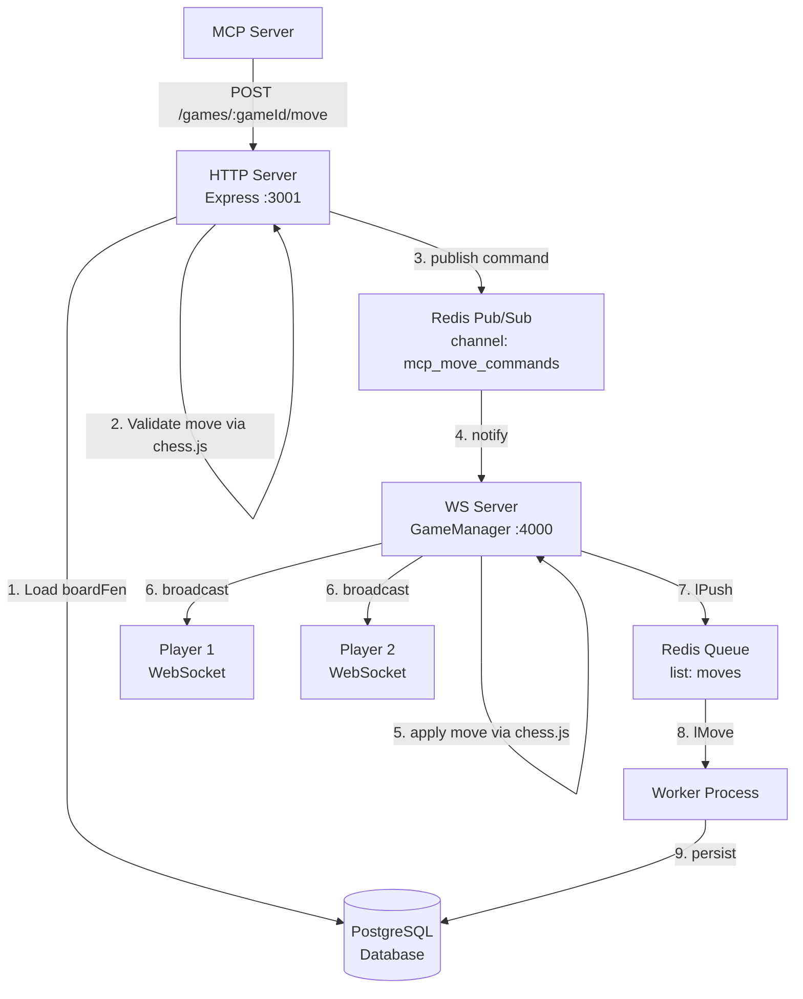
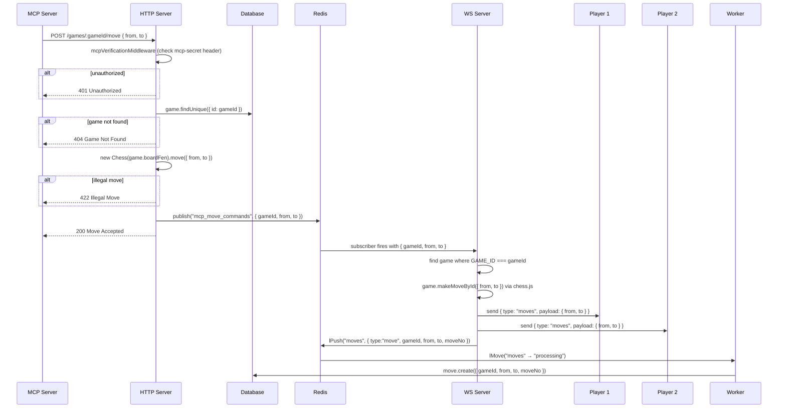

# System Design: `POST /games/:gameId/move`

## Overview

The MCP server needs to inject a chess move into a live game through a secure HTTP endpoint.
The core challenge is that all live game state — the chess board, move history, and player WebSocket
connections — lives exclusively inside the **WS server process**. The HTTP server has no direct
access to any of it.

The solution uses **Redis Pub/Sub** as a message bridge between the HTTP server and the WS server.

---

## High-Level Architecture



---

## Request Lifecycle



---

## Why Redis Pub/Sub and Not a Direct WebSocket Connection

The WS server looks up active games by **WebSocket object reference**, not by `gameId`:

```typescript
// apps/ws/src/gameManger.ts
const game = this.games.find(
  (g) => g.player1.Websocket === socket || g.player2.Websocket === socket
);
```

It also enforces turn order by comparing socket identity:

```typescript
// apps/ws/src/game.ts
if (this.moveCount % 2 === 0 && socket !== this.player1.Websocket) return;
if (this.moveCount % 2 === 1 && socket !== this.player2.Websocket) return;
```

If the HTTP server opened a new WebSocket to the WS server to inject a move, that socket would not
match either player — the game lookup returns `undefined` and the move is silently dropped.
Sharing in-process memory is also impossible because both servers are separate OS processes.

Redis Pub/Sub sidesteps all of this by delivering a command that the WS server processes
internally using its own `gameId`-based lookup.

---

## Responsibility Split

| Server | Responsibility |
|---|---|
| HTTP Server | Auth, early move validation, publish command to Redis |
| WS Server | Apply move to chess.js board, broadcast to both players, push to persistence queue |
| Worker | Read from Redis queue, write move to DB |
| Redis | Pub/Sub bridge (HTTP → WS) and reliable queue (WS → Worker) |

---

## Changes Required in Each Service

### HTTP Server (`apps/backend`)

- Load `boardFen` from DB for the given `gameId`
- Instantiate `new Chess(boardFen)` and call `.move({ from, to })` — throws if illegal
- On success, `redis.publish("mcp_move_commands", JSON.stringify({ gameId, from, to }))`
- Return `200` immediately (fire-and-forget — the WS server handles the rest)

### WS Server (`apps/ws`)

Two additions needed:

**1. Subscribe to move commands in `GameManager.redisConnect()`**

```typescript
const subscriber = this.redis.duplicate();
await subscriber.connect();
await subscriber.subscribe("mcp_move_commands", (raw: string) => {
    const { gameId, from, to } = JSON.parse(raw);
    const game = this.games.find((g) => g.GAME_ID === gameId);
    if (!game) return;
    game.makeMoveById({ from, to }, this.redis);
});
```

**2. Add `makeMoveById` to the `Game` class**

Unlike the existing `makeMove` (which checks socket identity), this method is called by a trusted
internal command, so it skips the ownership check and broadcasts to both players.

```typescript
public async makeMoveById(move: { from: string; to: string }, redis: any) {
    try {
        this.board.move(move);
    } catch {
        return; // chess.js rejects illegal move
    }

    this.moves.push({ from: move.from, to: move.to, moveCount: this.moveCount });
    this.moveCount++;

    const payload = JSON.stringify({ type: MOVES, payload: move });
    this.player1.Websocket.send(payload);
    this.player2.Websocket.send(payload);

    await redis.lPush("moves", JSON.stringify({
        type: "move",
        gameId: this.GAME_ID,
        playerId: "mcp",
        from: move.from,
        to: move.to,
        moveNo: this.moveCount - 1,
    }));
}
```

### Worker (`apps/worker`)

No changes needed. The worker already handles `type: "move"` messages from the `moves` list.

---

## Edge Cases

| Case | Handling |
|---|---|
| Game not in WS server memory (finished or not started) | WS subscriber silently ignores; HTTP already returned 200 |
| Illegal move (e.g. wrong turn, blocked piece) | chess.js throws in HTTP server → 422 returned before publishing |
| Redis publish fails | Wrap in try/catch → return 500 to MCP |
| WS server is down | Pub/Sub message is lost — Redis does not persist pub/sub messages |
| Move applied twice (race between MCP and player) | chess.js in WS server will reject the second move as illegal |
